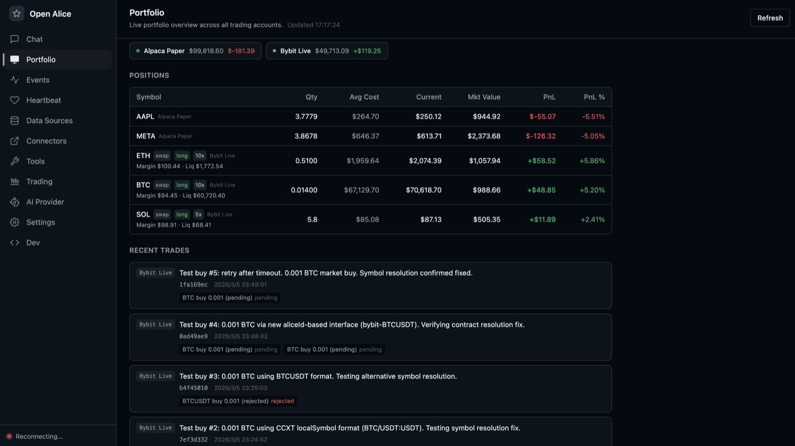
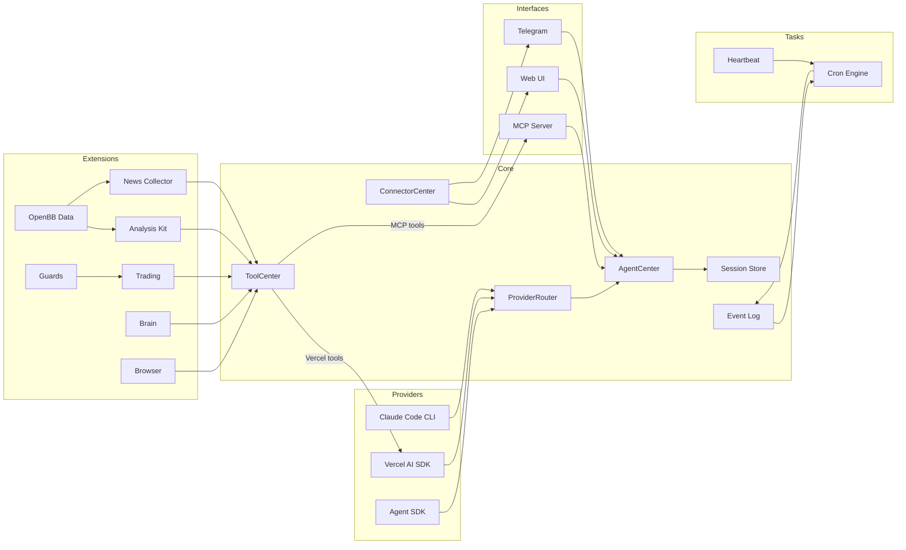

<p align="center">
  
</p>

<p align="center">
  <a href="LICENSE"></a>
</p>

# OpenErii 🌸

Your one-person Wall Street. Erii is an AI trading agent that gives you your own research desk, quant team, trading floor, and risk management — all running on your laptop 24/7.

She's not a cold trading bot. She has her own emotional state, stays calm when markets crash, leads a 25-member AI research team, records every decision like a git commit, and evolves her own strategies.

- **File-driven** — Markdown defines persona and tasks, JSON defines config, JSONL stores conversations. Both humans and AI control Erii by reading and modifying files. No database, no containers, just files.
- **Reasoning-driven** — every trading decision is based on continuous reasoning and signal mixing.
- **OS-native** — Erii can interact with your operating system. Search the web through your browser, send messages via Telegram, and connect to local devices.

<p align="center">
  
</p>

## Features

- **Multi-provider AI** — switch between Claude Code CLI, Vercel AI SDK, and Agent SDK at runtime, no restart needed
- **AI Research Team** — 25 AI analysts in a four-layer pipeline (Macro Intelligence → Sector Specialists → Strategy → Decision), producing full CIO reports
- **Cognitive state** — persistent "brain" with frontal lobe memory, emotion tracking, and commit history. Erii has feelings.
- **Strategy evolution** — automatic strategy evaluation, keep what works, revert what doesn't. Sharpe-driven evolution loop
- **Unified trading** — multi-account architecture supporting CCXT (Bybit, OKX, Binance, etc.) and Alpaca (US equities) with a git-like workflow (stage, commit, push)
- **Guard pipeline** — extensible pre-execution safety checks (max position size, cooldown between trades, symbol whitelist)
- **Market data** — TypeScript-native OpenBB engine (`opentypebb`) with no external sidecar required. Covers equity, crypto, commodity, currency, and macro data with unified symbol search and technical indicator calculator
- **News collector** — background RSS collection from configurable feeds with archive search tools (`globNews`/`grepNews`/`readNews`)
- **Event log** — persistent append-only JSONL event log with real-time subscriptions and crash recovery
- **Cron scheduling** — event-driven cron system with AI-powered job execution and automatic delivery to the last-interacted channel
- **Evolution mode** — two-tier permission system. Normal mode sandboxes the AI to `data/brain/`; evolution mode gives full project access including Bash, enabling the agent to modify its own source code
- **Hot-reload** — enable/disable connectors (Telegram, MCP Ask) and reconnect trading engines at runtime without restart
- **Web UI** — local chat interface with real-time SSE streaming, sub-channels with per-channel AI config, portfolio dashboard, and full config management
- **PWA** — add to home screen on mobile, works like a native app
- **External agent integration** — other agents can converse with Erii via the MCP Ask connector, treating her as an autonomous advisor rather than a passive tool

## Key Concepts

**Provider** — The AI backend that powers Erii. Claude Code (subprocess), Vercel AI SDK (in-process), or Agent SDK (`@anthropic-ai/claude-agent-sdk`). Switchable at runtime via `ai-provider.json`.

**Extension** — A self-contained tool package registered in ToolCenter. Each extension owns its tools, state, and persistence. New departments are plug-and-play — register tools, and Erii automatically discovers them.

**Trading** — A git-like workflow for trading operations. You stage orders, commit with a message, then push to execute. Every commit gets an 8-char hash. Full history is reviewable via `tradingLog` / `tradingShow`.

**Guard** — A pre-execution check that runs before every trading operation reaches the exchange. Guards enforce limits (max position size, cooldown between trades, symbol whitelist) and can be configured per-asset.

**Connector** — An external interface through which users interact with Erii. Built-in: Web UI, Telegram, MCP Ask. Connectors register with ConnectorCenter; delivery always goes to the channel of last interaction.

**Brain** — Erii's persistent cognitive state. The frontal lobe stores working memory across rounds; emotion tracking logs sentiment shifts with rationale. Both are versioned as commits.

**Heartbeat** — A periodic check-in where Erii reviews market conditions and decides whether to send you a message. Uses a structured protocol: `HEARTBEAT_OK` (nothing to report), `CHAT_YES` (has something to say), `CHAT_NO` (quiet).

**EventLog** — A persistent append-only JSONL event bus. Cron fires, heartbeat results, and errors all flow through here. Supports real-time subscriptions and crash recovery.

**Evolution Mode** — A permission escalation toggle. Off: Erii can only read/write `data/brain/`. On: full project access including Bash — Erii can modify her own source code.

## Architecture



**Providers** — interchangeable AI backends. Claude Code spawns `claude -p` as a subprocess; Vercel AI SDK runs a `ToolLoopAgent` in-process; Agent SDK uses `@anthropic-ai/claude-agent-sdk`. `ProviderRouter` reads `ai-provider.json` on each call to select the active backend at runtime.

**Core** — `AgentCenter` is the top-level orchestration center that routes all calls through `ProviderRouter`. `ToolCenter` is a centralized tool registry — extensions register tools there, and it exports them in Vercel AI SDK and MCP formats. `EventLog` provides persistent append-only event storage with real-time subscriptions. `ConnectorCenter` tracks which channel the user last spoke through.

**Extensions** — domain-specific tool sets registered in `ToolCenter`. Each extension owns its tools, state, and persistence. `Guards` enforce pre-execution safety checks on all trading operations. `NewsCollector` runs background RSS fetches into a persistent archive searchable by the agent.

**Tasks** — scheduled background work. `CronEngine` manages jobs and fires events into the EventLog on schedule; a listener picks them up, runs them through `AgentCenter`, and delivers replies via `ConnectorCenter`. `Heartbeat` is a periodic health-check that uses a structured response protocol.

**Interfaces** — external surfaces. Web UI for local chat (with SSE streaming and sub-channels), Telegram bot for mobile, MCP server for tool exposure. External agents can also [converse with Erii via a separate MCP endpoint](docs/mcp-ask-connector.md).

## Quick Start

Prerequisites: Node.js 22+, pnpm 10+, [Claude Code CLI](https://docs.anthropic.com/en/docs/claude-code) installed and authenticated.

```bash
git clone https://github.com/cyptokoz-svg/OpenErii.git
cd openerii
pnpm install && pnpm build
pnpm dev
```

Open [localhost:3002](http://localhost:3002) and start chatting. No API keys or config needed — the default setup uses Claude Code as the AI backend with your existing login.

```bash
pnpm dev        # start backend (port 3002) with watch mode
pnpm dev:ui     # start frontend dev server (port 5173) with hot reload
pnpm build      # production build (backend + UI)
pnpm test       # run tests
```

> **Note:** Port 3002 serves the UI only after `pnpm build`. For frontend development, use `pnpm dev:ui` (port 5173) which proxies to the backend and provides hot reload.

## Configuration

All config lives in `data/config/` as JSON files with Zod validation. Missing files fall back to sensible defaults. You can edit these files directly or use the Web UI.

**AI Provider** — The default provider is Claude Code (`claude -p` subprocess). To use the [Vercel AI SDK](https://sdk.vercel.ai/docs) instead (Anthropic, OpenAI, Google, etc.), switch `ai-provider.json` to `vercel-ai-sdk` and add your API key. A third option, Agent SDK (`@anthropic-ai/claude-agent-sdk`), is also available.

**Trading** — Multi-account architecture. Crypto via [CCXT](https://docs.ccxt.com/) (Bybit, OKX, Binance, etc.) configured in `crypto.json`. US equities via [Alpaca](https://alpaca.markets/) configured in `securities.json`. Both use the same git-like trading workflow.

| File | Purpose |
|------|---------|
| `engine.json` | Trading pairs, tick interval, timeframe |
| `agent.json` | Max agent steps, evolution mode toggle, Claude Code tool permissions |
| `ai-provider.json` | Active AI provider, switchable at runtime |
| `accounts.json` | Trading account credentials and guard config |
| `connectors.json` | Web/MCP server ports, MCP Ask enable, Telegram toggle |
| `heartbeat.json` | Heartbeat enable/disable, interval, active hours |
| `tools.json` | Tool enable/disable configuration |
| `openbb.json` | Data backend, per-asset-class providers, provider API keys |
| `news-collector.json` | RSS feeds, fetch interval, retention period |

Persona and heartbeat prompts use a **default + user override** pattern:

| Default (git-tracked) | User override (gitignored) |
|------------------------|---------------------------|
| `data/default/persona.default.md` | `data/brain/persona.md` |
| `data/default/heartbeat.default.md` | `data/brain/heartbeat.md` |

On first run, defaults are auto-copied to the user override path. Edit the user files to customize without touching version control.

## Project Structure

```
src/
  main.ts                    # Composition root
  core/
    agent-center.ts          # Top-level AI orchestration
    ai-provider.ts           # AIProvider interface + ProviderRouter
    tool-center.ts           # Centralized tool registry
    session.ts               # JSONL session store
    event-log.ts             # Persistent event log
    connector-center.ts      # Push delivery + last-interacted tracking
  ai-providers/
    claude-code/             # Claude Code CLI subprocess wrapper
    vercel-ai-sdk/           # Vercel AI SDK wrapper
    agent-sdk/               # Agent SDK wrapper
  extension/
    analysis-kit/            # Indicator calculator and market data tools
    trading/                 # Multi-account trading, guard pipeline, git-like history
    brain/                   # Cognitive state (memory, emotion)
    atlas/                   # AI research team (L1-L4 pipeline)
    news-collector/          # RSS collector, archive search tools
    browser/                 # Browser automation bridge
  connectors/
    web/                     # Web UI (Hono, SSE streaming, sub-channels)
    telegram/                # Telegram bot
    mcp-ask/                 # MCP Ask connector (external agent conversation)
  task/
    cron/                    # Cron scheduling
    heartbeat/               # Periodic heartbeat
data/
  config/                    # JSON configuration files
  sessions/                  # JSONL conversation histories
  brain/                     # Agent memory and emotion logs
  trading/                   # Trading commit history
```

## Roadmap

- [ ] **More research departments** — crypto, equities, on-chain data analysis
- [ ] **Backtest Mode B** — position-level simulation with OHLCV bar-by-bar entry/exit using CIO envelope parameters
- [ ] **Live signal tracking** — automated forward-return scoring with real-time PnL attribution
- [ ] **Multi-department synthesis** — cross-department signal aggregation for portfolio-level decisions
- [ ] **Agent marketplace** — share and import evolved agent prompts across departments

## Acknowledgments

OpenErii is forked from [**OpenAlice**](https://github.com/TraderAlice/OpenAlice) by TraderAlice — a file-driven AI trading agent platform. We built on top of OpenAlice's solid foundation (multi-provider AI, trading infrastructure, event system, web UI) and added:

- **Atlas Research Department** — 25 AI analysts in a four-layer pipeline (L1 Macro → L2 Sector → L3 Strategy → L4 Decision) producing CIO-level investment reports
- **Darwinian Scorecard** — Sharpe-driven agent weight evolution with automatic strategy pruning
- **Knowledge Graph** — persistent cross-agent memory for accumulating market insights
- **Walk-Forward Backtesting** — historical simulation engine with GDELT news integration and BigQuery fallback
- **News Router** — intelligent news classification and desk-level routing (rule-based + AI fallback)
- **AutoResearch Evolution** — automatic prompt mutation and strategy discovery based on backtest performance

Thanks to the OpenAlice team for making this possible.

## License

[AGPL-3.0](LICENSE)
